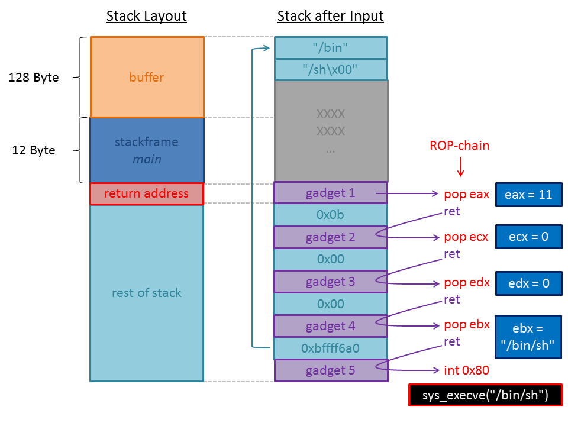
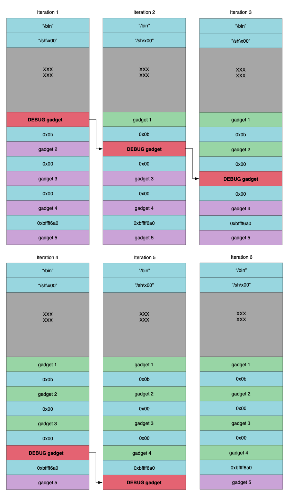

Title: Automated ROP Chain Integrity
Date: 2019-08-29 5:13
Category: Research
Tags: research, rop, exploit dev
Slug: Automated-ROP-Chain-Integrity
Authors: bannedit
Status: Published
Summary:
In software engineering unit testing has become the norm. In the world of exploit development testing and automation is lacking. This blog post will introduce a technique for automated testing of Return Oriented Programming (ROP) chain integrity.

Admittedly, automation in exploit development does exist, there are tools such as mona [[1]](https://github.com/corelan/mona) and rop finding tools [[2]](https://github.com/JonathanSalwan/ROPgadget) [[3]](https://github.com/sashs/Ropper) that make the process a lot simpler than it once was. However, the point of this blog is to show that automation can go beyond automating the tasks involved in exploit development and also be applied to what happens next, maintaining working exploit code.

### Introduction

In software engineering unit testing has become the norm. In the world of exploit development testing and automation is lacking. This blog post will introduce a technique for automated testing of Return Oriented Programming (ROP) chain integrity.

Admittedly, automation in exploit development does exist, there are tools such as mona [[1]](https://github.com/corelan/mona) and rop finding tools [[2]](https://github.com/JonathanSalwan/ROPgadget) [[3]](https://github.com/sashs/Ropper) that make the process a lot simpler than it once was. However, the point of this blog is to show that automation can go beyond automating the tasks involved in exploit development and also be applied to what happens next, maintaining working exploit code.

This is an idea I have had for a while, and I just wanted to get it out there. It is by no means perfect, but it should work in the vast majority of cases. I won't describe in detail the process of automating every aspect of this technique but, I will describe the technique in enough detail that anyone interested should be able to implement it on their own with minimal effort.

Lets start by framing the premise, consider for a moment you have written an exploit for a vulnerability. These days the amount of time and effort involved in exploit development is always going up. Now consider the vulnerable software was just patched. This means we need to spend more time checking that the exploit still works for the new version of the software. 

Exploits in practice can be very fragile. Often times, exploit code relies on offsets from known locations. The art of exploitation over the years has advanced greatly and weaponized exploits are now a very real thing. However, even as techniques have advanced, the most minor of changes can sometimes cause an exploit to crash and burn.

The naive approach to testing an exploit against a new version of the target software would just be to load up a Virtual Machine (VM) and launch the exploit and check if it still works. If it doesn't work we need to then determine why. Has the vendor patched the vulnerability? Has something else changed that has broken our exploit? Commonly the answer is patching has altered the offsets by adding or removing instructions to Dynamic Link Libraries (DLL) that the exploit ROP chain depends on.

Now the question becomes, can we automate this process? The simple answer is yes we can. We can also improve upon it by automatically repairing when suitable.

### ROP Primer

Before I delve into the gory details of how we could automate a solution to solve the problem of exploit testing, I want to cover the basics of Return Oriented Programming [[4]](https://en.wikipedia.org/wiki/Return-oriented_programming).

Return Oriented Programming is an exploitation technique that uses code that already exists within an application to perform useful actions. Typically, a ROP chain will simply change the protection flags on a page of memory to be executable. Alternatively, some ROP chains might allocate memory as executable and copy shellcode into the allocated memory. However, a ROP chain can perform any action that can be constructed from the code within the target process.

 ROP chains are comprised of gadgets, or small chunks of code that are followed by a return instruction. These gadgets are chained together by manipulating stack memory and constructing stack frames.

 >**_Stack Layout Before and After Exploitation of a Stack Based Buffer Overflow - image source: [https://devel0pment.de/?p=366](https://devel0pment.de/?p=366)_**

The above illustration depicts the stack memory at the time of exploiting a stack based buffer overflow. As can be seen a ROP chain is simply a chain of gadgets that reference code already existing in the vulnerable process. In this instance the ROP payload is building the arguments necessary to call the sys_execve system call on a 32bit Linux system. 

The gadgets:
* gadget 1 sets the *eax* register to 11 (0x0b in hex) 
* gadget 2 sets the *ecx* register to 0
* gadget 3 sets the *edx* register to 0 
* gadget 4 constructs a pointer to the "/bin/sh" string in the *ebx* register
* gadget 5 calls the sys_execve system call via the *int 0x80* interrupt instruction

If everything goes well, the exploit will cause the vulnerable process to spawn a */bin/sh* shell. 

If you find yourself lost here as to why the ROP chain is performing these actions, it might be worth checking out some tutorials related to linux shellcode [[5]](https://0x00sec.org/t/linux-shellcoding-part-1-0/289).

### Automated ROP Chain Integrity

Now that I've covered the basics of how ROP works, lets dive into the details of automated ROP chain integrity testing.

First things first, let introduce the concept of a debug gadget. A debug gadget is a simple ROP gadget that simply points to a software breakpoint instruction. In the case of this blog I will be talking primarily about the x86 architecture so for our purposes the instruction is int3. The int3 instruction in x86 is a single byte opcode 0xcc. So, all we need to do is find a pointer to the opcode 0xcc. Note, typically ROP gadgets end with a ret instruction. For our purposes we only need a gadget that points to the int3 instruction because this will halt execution and any further instructions will not be executed.

Now that we know what a debug gadget is and how to find one, we can discuss the proposed technique.

The technique is to loop over execution of the exploit swapping out gadgets with debug gadgets. After each iteration we replace the previous gadget with the original. We can achieve everything we need using a scriptable debugger, such as, [cdb](https://github.com/bannedit/cdb), [winappdbg](https://github.com/MarioVilas/winappdbg), [pwndbg](https://github.com/pwndbg/pwndbg), just to name a few. We can monitor execution via a debugger, and loop over execution by restarting the process.

>
**_ROP Chain Integrity Algorithm Visualized_**

The above image depicts the ROP chain integrity algorithm in action. This image is using the same ROP chain previously discussed.

If we hit the breakpoint in the debugger on the first iteration we know that our ROP chain is still being executed, we also know the vulnerability still exists.

Next if we hit the debug breakpoint for the second gadget we know that the first gadget is still executing as expected. By continuing through we can loop over each gadget ensuring that they all execute as expected.

Finally, testing the last gadget is pretty simple, we only need to monitor for the expected behavior. In this case, we would be looking for execution of */bin/sh*.

If we run into an instance where our debug gadget does not execute, we know then that the previous gadget is no longer functioning as expected and requires repair. The beauty of this algorithm is we can automate the repair process as well.

### Automating Gadget Repair

To automate the repair of a gadget we need to know what the original instructions were. This can be done by defining a simple syntax within the exploit code and parsing that, or we can implement some kind of database storage system containing the ROP gadget instructions of a known good execution. There are likely other possible solutions as well.

The only thing we really care about however, is knowing the instructions of the original gadget which has now become defunct. With this knowledge we can simply search for replacement gadgets. 

When we find a matching gadget we can even replace it in the exploit source code automatically and initiate another round of testing to ensure that the new gadget works as expected.

### Potential Pitfalls

This technique has a lot to offer. However, it is tricky to implement. Firstly, we need to know the difference between a gadget and other data placed on the stack. This can be overcome by implementing some kind of syntax as explained earlier.

Other pitfalls might occur during the automation of the repair process. For example, what do we do if we run into a situation where we cannot find suitable replacement gadgets. This could be solved in an automated fashion using a Intermediate Language (IL) and inferring the intent of the instructions of the gadget and trying to find other gadgets which translate to similar IL. Emulation can also be used to bruteforce the discovery of a suitable gadget, however this approach does lack a bit of elegance and could be time consuming. 

Either way, the majority of issues one might run into while implementing this technique can be overcome.

### Conclusion

While exploit development has matured over the years, there are still areas for improvement. Maintaining a working exploit manually is no trivial task. Testing is a common practice in software engineering and the same practice should be applied to exploit development. After all, exploit development is still a form of software engineering.

Hopefully, the concepts introduced in this blog post will save exploit developers time in the future. Implementing the concepts should be relatively simple. The hardest aspect is programmatically replacing ROP gadgets and automating the repair process.

### References

1. Corelan Mona Github [https://github.com/corelan/mona](https://github.com/corelan/mona)

2. Jonathan Salwan ROPGadget Github [https://github.com/JonathanSalwan/ROPgadget](https://github.com/JonathanSalwan/ROPgadget)

3. Sascha Schirra Ropper Github [https://github.com/sashs/Ropper](https://github.com/sashs/Ropper)

4. Wikipedia Return Oriented Programming [https://en.wikipedia.org/wiki/Return-oriented_programming](https://en.wikipedia.org/wiki/Return-oriented_programming)

5. 0x00sec Linux Shellcoding Part 1.0 [https://0x00sec.org/t/linux-shellcoding-part-1-0/289](https://0x00sec.org/t/linux-shellcoding-part-1-0/289)

6. scryh's RPISEC/MBE writeup lab05 [https://devel0pment.de/?p=366](https://devel0pment.de/?p=366)