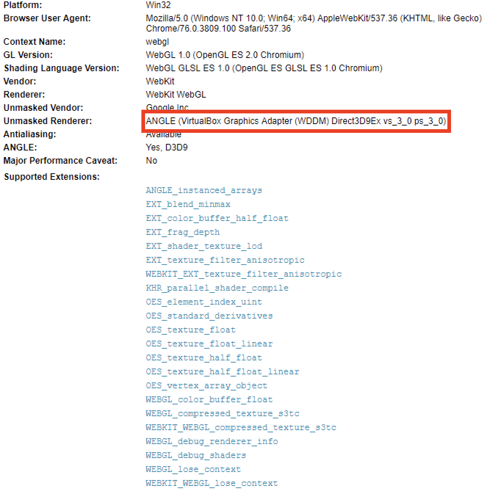
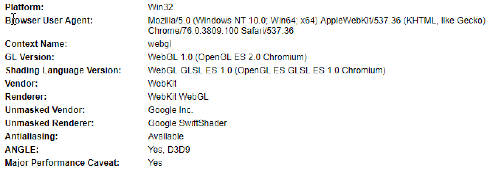

Title: Virtual Machine Detection In The Browser
Date: 2019-08-20 5:00 
Category: Research
Tags: research, vm detection, webgl 
Slug: Virtual-Machine-Detection-In-The-Browser
Authors: bannedit
Status: Published
Summary: <p>Virtual Machine (VM) detection is nothing new. Malware has been doing it for over a decade now. Over time the techniques have advanced as defenders learned new ways of avoiding VM detection. </p><p>A while back a friend and I were working on a project related to exploit delivery via a web application for redteaming purposes. I wanted a way to fingerprint visitors of the site and hash the fingerprint data so I could look for potential repeat visitors. While investigating fingerprinting I stumbled upon something pretty interesting. I was looking at some code that collected information about WebGL capabilities. I quickly realized that some of the fingerprinting information could be useful for VM detection because vendor names were exposed. In this particular instance the string "VMWare" was contained within the WebGL information. After some more testing I also discovered that VirtualBox reported the same kind of information. </p><p>Once I realized it was potentially possible to detect VMs from the browser I started to dig deeper and began searching for other research related to this discovery. I found a pretty well researched academic paper <a href=http://yinzhicao.org/TrackingFree/crossbrowsertracking_NDSS17.pdf>[1]</a> related to tracking users across multiple browsers. This gave me some other potential techniques that could be applied to VM detection.</p><p>The end goal of this research is to have multiple techniques for VM detection. Multiple techniques lead to much more accurate detection. Since some techniques are more false-positive prone than others, a weighting system can be applied to the detection capabilities. This allows us to generate detection confidence scoring. This can help account for inaccuracies of certain detection methods. Given enough testing and data it would then be possible to come up with a reasonable threshold value. If a browser scores above the threshold then it would most likely be within a VM. Alternatively, if the browser scored below the threshold value it could be considered to be running on physical hardware.</p>


### Introduction
Virtual Machine (VM) detection is nothing new. Malware has been doing it for over a decade now. Over time the techniques have advanced as defenders learned new ways of avoiding VM detection.

A while back a friend and I were working on a project related to exploit delivery via a web application for redteaming purposes. I wanted a way to fingerprint visitors of the site and hash the fingerprint data so I could look for potential repeat visitors. While investigating fingerprinting I stumbled upon something pretty interesting. I was looking at some code that collected information about WebGL capabilities. I quickly realized that some of the fingerprinting information could be useful for VM detection because vendor names were exposed. In this particular instance the string "VMWare" was contained within the WebGL information. After some more testing I also discovered that VirtualBox reported the same kind of information. 

Once I realized it was potentially possible to detect VMs from the browser I started to dig deeper and began searching for other research related to this discovery. I found a pretty well researched academic paper [[1]](http://yinzhicao.org/TrackingFree/crossbrowsertracking_NDSS17.pdf) related to tracking users across multiple browsers. This gave me some other potential techniques that could be applied to VM detection.

The end goal of this research is to have multiple techniques for VM detection. Multiple techniques lead to much more accurate detection. Since some techniques are more false-positive prone than others, a weighting system can be applied to the detection capabilities. This allows us to generate detection confidence scoring. This can help account for inaccuracies of certain detection methods. Given enough testing and data it would then be possible to come up with a reasonable threshold value. If a browser scores above the threshold then it would most likely be within a VM. Alternatively, if the browser scored below the threshold value it could be considered to be running on physical hardware.

### Techniques

Now that I have covered some of the background information and history leading up to this blog post we can start to dig into the actual techniques.

As mentioned prior in the introduction, WebGL can provide a lot of information about the OpenGL implementation including vendor information. The WEBGL_debug_renderer_info extension [[2]](https://developer.mozilla.org/en-US/docs/Web/API/WEBGL_debug_renderer_info) can be used to query for debug information such as the WebGL vendor and rendered.

```javascript
var canvas = document.createElement('canvas');
var gl = canvas.getContext('webgl');

var debugInfo = gl.getExtension('WEBGL_debug_renderer_info');
var vendor = gl.getParameter(debugInfo.UNMASKED_VENDOR_WEBGL);
var renderer = gl.getParameter(debugInfo.UNMASKED_RENDERER_WEBGL);

console.log(vendor);
console.log(renderer);
```

Additionally, extension availability can be queried using the **_getExtension_** method on a WebGL context. I have not fully explored this avenue but it might be possible to detect certain WebGL implementations provided by VMs based on the extensions available. Though this idea is likely very false-positive prone.

Below is a screenshot from [[3]](https://webglreport.com) WebGLReport a website dedicated to fingerprinting WebGL.

>
**_VirtualBox Windows 10 x64 VM Google Chrome Visiting webglreport.com_**

Now, it is important to note that this depends on how the VM is configured. In Virtual Box for example, setting the graphics controller setting under Display to VMSVGA will report cause WebGL to use CPU based implementations of OpenGL which is browser dependent. However, this could still be a useful indicator that the client machine is running in a VM because most modern hardware has integrated GPUs and can provide access to OpenGL natively. Just keep in mind that CPU based OpenGL implementations do not necessarily mean it is a VM outright.

>
**_VirtualBox Windows 10 x64 VM Google Chrome Using VMSVGA Visiting webglreport.com_**

This screenshot depicts Google Chrome utilizing the CPU based OpenGL implementation renderer Google SwiftShader [[4]](https://github.com/google/swiftshader).


Another technique seen in normal malware is to determine the screen width and height. This can be achieved in Javascript as well. Additionally, color depth and bits per pixel are other potentially good indicators related to the display.

```javascript
var width = screen.width;
var height = screen.height;
var color_depth = screen.colorDepth;
var bitspp = screen.pixelDepth;
```

More details on the screen object can be found at [[5]](https://www.w3schools.com/jsref/obj_screen.asp).

Can we detect the amount of RAM on the client? You bet. Again using Javascript we can determine roughly the amount of RAM available on the browser. One quirk to note here is that the browser will only report RAM values in gigabytes (gb). It also has a quirk where it will only report up to 8gb and as low as 256mb (0.25gb). These ranges of values however, are still enough to use as a VM detection method. Most physical workstations these days come with at least 8gb of RAM. Detecting smaller amounts of RAM such as 2gb or less would be a good indicator the client browser is in a VM. The specification for the Device Memory can be found at [[6]](https://www.w3.org/TR/device-memory/)

```javascript
var ram = navigator.deviceMemory;
```

Finally, the last technique I will be covering detects the number of CPU cores. This is done by performing timing attacks using multiple web workers running simultaneously. During my testing of this technique I found it to be very accurate. I tested this concept out using the [[7]](https://oswg.oftn.org/projects/core-estimator/demo/) Core Estimator Demo site. A small number of CPU cores can be a decent VM indicator and has been used by malware in the past. Core Estimator also provides the Javascript libraries on github [[8]](https://github.com/oftn-oswg/core-estimator).

>
**_VirtualBox Windows 10 x64 VM Google Chrome 2 CPU Cores Tested with Core Estimator_**

### Conclusion

This blog post covered four unique VM detection capabilities that can be performed from Javascript. When I first discovered these techniques my initial thought was to apply the concepts toward VM detection. Hopefully, both defenders and offensive security professions can find something useful to apply these techniques toward.

It is interesting to see that academics and various other researchers have applied some of the same concepts toward fingerprinting and privacy issues. 

### References

1. (Cross-)Browser Fingerprinting via OS and
Hardware Level Features [http://yinzhicao.org/TrackingFree/crossbrowsertracking_NDSS17.pdf](http://yinzhicao.org/TrackingFree/crossbrowsertracking_NDSS17.pdf)

2. MDN web-docs WEBGL_debug_renderer_info [https://developer.mozilla.org/en-US/docs/Web/API/WEBGL_debug_renderer_info](https://developer.mozilla.org/en-US/docs/Web/API/WEBGL_debug_renderer_info)

3. WebGL Report [https://webglreport.com](https://webglreport.com)

4. Google Swiftshader Github [https://github.com/google/swiftshader](https://github.com/google/swiftshader)  

5. W3 Device Memory Specification [https://www.w3.org/TR/device-memory/](https://www.w3.org/TR/device-memory/)

6. W3 Schools - The Screen Object [https://www.w3schools.com/jsref/obj_screen.asp](https://www.w3schools.com/jsref/obj_screen.asp)

7. Core Estimator Demo [https://oswg.oftn.org/projects/core-estimator/demo/](https://oswg.oftn.org/projects/core-estimator/demo/)

8. Core Estimator Github [https://github.com/oftn-oswg/core-estimator](https://github.com/oftn-oswg/core-estimator)